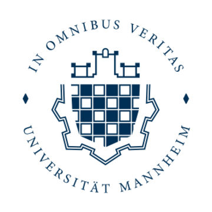
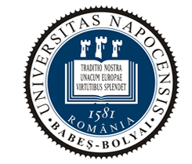
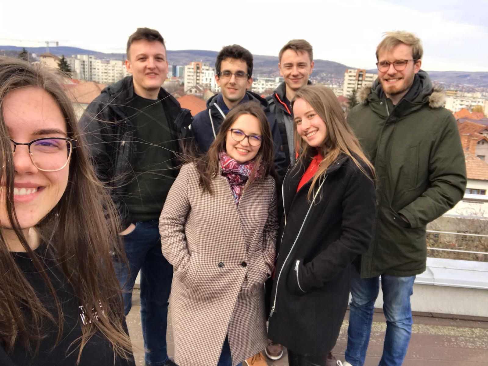

 
 
 

# EUROPEAN MASTER TEAM PROJECT 2020

    <a href="#about-this-project">About this Project</a> • 
    <a href="#who-we-are">Who We Are</a> •
    <a href="#development-process">Development Process</a> •
    <a href="#technical-documentation">Technical Documentation</a> •
    <a href="#evaluation">Evaluation</a>

## About this Project
This project was developed as part of an international university team project in which students from the University of Mannheim, Germany, and students from Babeș-Bolyai University in Cluj, Romania, worked together for six months on a common research question. The project was mainly organized by the Institute for Enterprise Systems (InES) at the University of Mannheim.

The key goals of the project were given as follows:
* Understand and evaluate existing architectures in terms of software adapters which link incompatible APIs or devices (provided) to required interfaces (domain-models)
* Build an infrastructure and product for the automatic execution of service compositions independent of the available API-endpoints (that is “plug-and-play” at runtime)

The results of the six-month project, i.e. both the developed platform for the dynamic integration of external APIs and execution of service compositions and the comparison with existing technologies as well as the evaluation of the developed software prototype are documented in the following.

## Who We Are

We are all students in the area of computer science from the two mentioned universities:
technical_documentation/* <a href= "mailto:chisraluca66@yahoo.com">Chiș, Raluca</a> (Babeș-Bolyai University, Cluj)
* <a href= "mailto:andreeacoaja16@gmail.com">Coajă, Andreea</a> (Babeș-Bolyai University, Cluj)
* <a href= "mailto:mhessent@mail.uni-mannheim.de">Hessenthaler, Marius</a> (Universität Mannheim, Mannheim)
* <a href= "mailto:tohorn@mail.uni-mannheim.de">Horn, Tobias</a> (Universität Mannheim, Mannheim)
* <a href= "mailto:keszeg_flavia@yahoo.com">Keszeg, Flavia</a> (Babeș-Bolyai University, Cluj)
* <a href= "mailto:hokedo12@gmail.com">Mic, Bogdan</a> (Babeș-Bolyai University, Cluj)
* <a href= "mailto:pewidmer@mail.uni-mannheim.de">Widmer, Peter</a> (Universität Mannheim, Mannheim)

While the members from Germany are all studying in the master program in Business Informatics, three of the Romanian students are studying Bachelor Computer Science and one in the master program in Computer Science.

## Development Process
Apart from a one-week introduction phase at the beginning of the project, when the students from Mannheim travelled to Cluj, the entire cooperation during the project took place via digital media. 
In order to nevertheless work together successfully in such a large team with very heterogeneous previous knowledge, we pursued an agile development process and strict adherence to the **SCRUM** guidelines. As part of this, we agreed on week-long Sprints from Monday to Monday, with Sprint Review, Retrospective and Sprint Planning taking place in a joint meeting via *Skype* at the end of each Sprint. Apart from this, we agreed on a written daily twice a week via the Messaging Service *Discord*, which was also used for other written communication during the project. The roles of Product Owner and Scrum Master changed between the team members during the project. The role of the external customer was taken over by the supervisors from the InES.

## Technical Documentation
The following documentation should enable a technically experienced person to understand the function and the interaction of the core modules of the underlying **Microservice Architecture** of the developed software prototype. On the other hand, the implementation and the underlying concepts, especially in the area of dynamic integration of further services, should be addressed to the extent that an external person is able to integrate further services or even continue working on the developed prototype.

After a description of the overall archtitecture, the four microservices that are basically independent of each other, are explained in more detail. Finally, the general approach to Continuous Integration and Continous Delivery that was pursued is explained shortly.
* [Overall Microservice Architecture](technical_documentation/overall_microservice_archtitecture.md)
* [Frontend Service](technical_documentation/frontend_service.md)
* [Master Service](technical_documentation/master_service.md)
* [Service Provider](technical_documentation/service_provider.md)
* [User Service](technical_documentation/user_service.md)
* [Approach to Continuous Integration and Continuous Delivery](technical_documentation/ci_cd_approach.md) 

Besides, there are two supplementary services that were initially developed as part of an earlier archtitecture idea which was based on several independent *Category Services* instead of having one more generic *Service Provider* and became redundant with the introduction of this (in case of [Finance Category Service](https://github.com/hokedo/tpmc_finance_category_service/tree/master/finance_category_service/api)) or were modified to serve only as an additional external API (in case of [Messaging Category Service](https://github.com/TobiasHorn1899/tpmc_messaging_category_service)) to be accessed by the *Service Provider* like any external API.

## Evaluation
Initially, it should be mentioned that the following evaluation does not claim to meet scientific standards. The aim is rather to give a short overview of comparable technologies in a first step. In doing so, similarities and differences between our platform and similar tools shall be pointed out. This should only be a purely qualitative comparison. In a second step, we quantitatively evaluated the performance of our platform against various criteria using previously defined use cases and associated evaluation tasks.  
* [Comparison With Existing Platforms](evaluation/comparison_with_existing_platforms.md)
* [Use-Case Based Evaluation Process](evaluation/use_case_based_evaluation_process.md)
