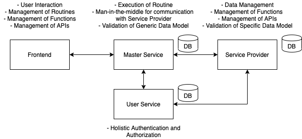

# TPMC Documentation

## Overview of the Microservice Architecture

In the first place, it is reasonable to describe the overall architecture of the solution of the European Master Team Project. The following figure illustrates the microservice approach and the interplay of the different services.

In the following documentation, generic concepets are sketched on a high level. Additionally, the different levels, namely Master Service, Service Provider, User Service and Frontend are described in a more detailed manner.

## Overview Data Model
### Generic Data Model
As described in the previous figure, one consistent meaning of a unified data model is key for reducing the complexity of the attribute mapping and handling in the Service Provider.

### Specific Data Model
In turn, the generic data model which is holistic over the whole architecture, each individual API which shall be requested, has its own specific data model. The Service Provider is able to translate/map this requiremenet to become a specific data model.

### Microservices
## Master Service
## Service Provider
## User Service
## Frontend
