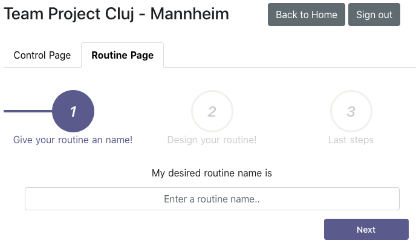

# User Guide

## Register User
Before you can start with the MTPP you have to register your own user.

*Click on the Button "You're new to MTPP? Sign Up!".*
<kbd>

</kbd>

*Enter a username and your password. Confirm by clicking "Sign Up".*
<kbd>

</kbd>

Now your account is created successfully. You can add our bundle of predefined Functions and APIs to your account, if you acquired the activation code.

*Check "Add bundles to my account (activation code required)" and enter the activation code in the field. To confirm click "Load built-in features!".*

*After the bundle was added to your account go to the Control page by clicking "Go to Control Page!".*

## Create a routine

After a user account was created and some Functions and APIs were load to the account either manually or by using the predefined bundle, routines can be created by the user.

*On the Control Page click on "Routine Page" or "+ Add routine" to create a new routine.*
<kbd>

</kbd>

*Enter the routine name and confirm with "Next".*
<kbd>

</kbd>

On the appearing page you can add and edit the routines components.
<kbd>

</kbd>

A Routine behaves like a workflow in which each Component is treated sequentially. A Routine can consists of the components Conditions and Operations. Both are structured in categories where similar types of Components are clustered. Conditions have to be fullfilled for the Routine to continue. If the condition is not fullfilled the Routine will interrupt. One very important Condition is the timer Condition "Routine start time" which checks checks if the current time equals the specified time to start the Routine. An Operation can be anykind of action or request to an external service. Each operation can have different input fields and one return value.

Let's start with adding the timer Condition "Routine start time".

*Click on the "Add a new Condition" button. Then select the timer category in the appearing dropdown menu. Finally select the "Routine start time" Condition in the second dropdown.*

<kbd>

</kbd>

*Specify a time, day and timezone at which the Routine should start.*

Next we can choose an Operation we want to happend next.

*Click on the "Add a new operation" button.*

You can now choose any category you like to add the corresponding operations. We want to retrieve the stock price of Google.

*Select "Finance" in the dropdown and select "Retrieve Stock Price of a Company".*
<kbd>

</kbd>

In Operations the results can be saved in variables so they can be used in other components. The result variable name is specified in the "Result variable name" field. The variable name has to start with a Dollar sign "$" to indicate that it is an variable and can be used in other Component's fields. In string fields we can just write the variable name including the Dollar sign. In number fields we have to change the field to variable mode by clicking the variable button and then selecting the variable name. The variable mode can be left by clicking the variable button again.

*Enter "Google" in the Company Name field and "$stockprice" in the "Result variable name" field.*

<kbd>

</kbd>

Next we want to compare the stockprice to the fixed number 445 with the Numbers Condition "Relation between two numbers".

*Click on the "Add a new Condition" button. Then select the Numbers category in the appearing dropdown menu. Finally select the "Relations between numbers" Condition in the second dropdown.*

This condition has three fields, the two values to compare and the operator. Remember that the value fields are normally numbers only fields.

*Click the "Variable buttong below the "Left Value" field and select the "$stockprice" variable. Select "Greater than" in the Operator dropdown. Finally type "445" in the "Right Value" field.*

<kbd>

</kbd>

If the Condition is satisfied i.e. the Apple stock price is greater than 445, the Routine will continue with the following components. If not, it would stop.

We now specified our first Routine with three Components. It would make sense to continue the Routine with additional Operations after the Condition was successful but for now this is enough to show you all functionalities.

Before starting the Routine we want to save it so our account.

*Click the "Next" button on the bottom right corner.*

<kbd>

</kbd>

*Finally click the "Finish" button.*

The Routine is now visible in the Control Page. If not visible immediately, try refreshing the page.

<kbd>

</kbd>

## Manage Routines

When a Routine is created it is automatically started when the timer condition is satistfied.

On the Control Page the existing Routines can be stated manually by clicking the play button, edited by clicking the pencil button or deleted by clicking the bin button.

 
<kbd>

</kbd>
 

## Devloper Suite

The Developer Suite allows to create, edit and delete Functions or APIs. It is important to mention that Operation and Function can be used synonymous, more precisly Function is only used in the context of the Developer Suite as it behaves like a function in programming. The developer suite requires decent knowledge about several cloud technologies and can render the app to break.

 
<kbd>

</kbd>
 

*Click the "Switch to Developer Suite" button. Confirm the warning with the "Ok" button.*

 
<kbd>

</kbd>
 

### Functions

Since we are already automatically in the Manage Functions mode we have to do nothing.

In case you are not:
*Click the "Manage Functions" button.*

#### Create
*Click the "Create a new Function" button.*

<kbd>

</kbd>

*Click on the switch next to "In protected mode" to make the fields editable. Click again to switch to protected mode again.*

We now see a number of fields that can or have to be filled.

**Category** specifies under which category the Function is listed in the Operations in the Routine creation.

**Function ID** is a unique identifier for the Function that can be a custom string.

**Function Label** is the label that is displayed for the Operation in the Routine creation.

A **result of a Function** is optional and can be deactived and activated with the "Function returns a Result Variable" checkbox.

**Result ID** is a unique identifier for the result that can be a custom string.

**Result Type** is the value type of the result.

**Result Pattern** is an optional pattern defined by a Regular Expression and has to be matched by the result.

**Result Label** is the label that is displayed for the Result in the Routine creation.

**Result Help Text** is the help text that is displayed for the Result in the Routine creation.

**Function fields** are optional. They can be added and deleted. The button "Add a new field" adds an additional field. The button "Reset created fields" deletes all fields from this Function.

**Field ID** is a unique identifier for the field that can be a custom string and can to be used in the API definition.

**Field Type** is the value type of the field.

**Field Label** is the label that is displayed for the Field in the Routine creation.

**Field Help Text** is the help text that is displayed for the Field in the Routine creation.

Here you can see an example of how the fields are defined for the "Retrieve Stock Price of a Company" Function.

<kbd>

</kbd>

*Click the "Save" button to save the new Function.*

#### Edit

You can edit the fields Category and Function label as well as add addtional fields for existing Functions.

*Click the "Edit existing Functions" button.*

<kbd>

</kbd>

*Click the "Show Details" button of the Function you want to edit.*

*Click on the switch next to "In protected mode" to make the fields editable.*

You can now edit the Fields.

*Click the "Save" button to save the changes.*

#### Delete

In the editing mode you can also delete existing Functions.

*Click the "Edit existing Functions" button.*

*Click the "Show Details" button of the Function you want to edit.*

*Click on the switch next to "In protected mode" to make the fields editable.*

*Click the "Delete function" button to delete the Function.*

### APIs

#### Create

#### Edit

#### Delete
